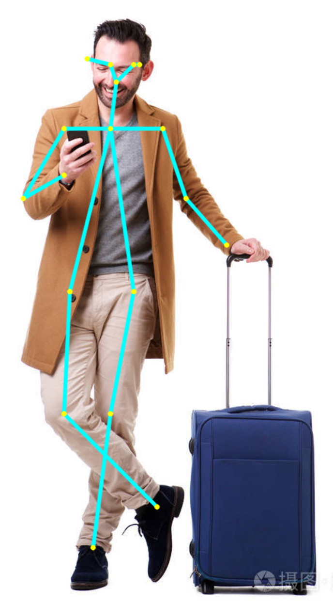
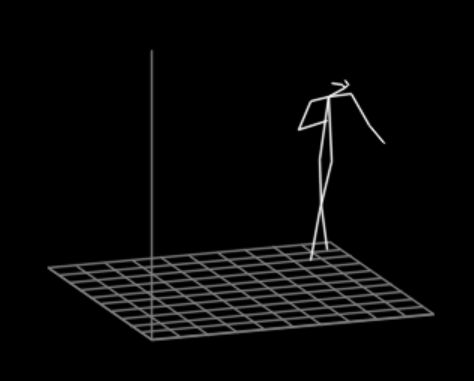

# 3D Pose Estimation Based On RGB Camera
#### Utter_pulsar

----

> 这是一个通用的由单目RGB相机生成2D与3D人体关键点坐标的算法，项目源自[Real-time 3D Multi-person Pose Estimation Demo](https://github.com/Daniil-Osokin/lightweight-human-pose-estimation-3d-demo.pytorch.git)。
> 该算法识别人体的18个关键点，包括耳朵、眼睛、鼻子、脖子、肩膀、肘部、手腕、臀部、膝盖和脚踝。
> 当然这个算法的原始作者是[Mariia Ageeva](https://github.com/marrmar)。项目非常轻量化，值得在应用项目中借鉴。




----
## 安装

- 环境安装

使用管理员权限打开CMD命令行窗口，并执行以下命令：
```CMD
git clone http://gitlab.miaohan.xyz/Utter_pulsar/litepose.git
cd LitePose
conda create -n litepose python=3.10
conda activate litepose
pip install -r requirements.txt 
```
----
## 运行

-  ```./human-pose-estimation-3d.pth```是这个模型的权重文件。
- ```./LiteDemo.py```是针对有RGB相机的连续持续性动作的预测效果的主运行文件。
- ```./PicDemo.py```是针对没有RGB相机时候，将图片存储在```./data/```目录下，针对图片的预测效果的主运行文件。

其中```./PicDemo.py```针对图片内容修改的地方为：

```python
    current_time = cv2.getTickCount()
    # 这里写图片的路径
    frame = cv2.imread("./data/traveler.jpg")
    input_scale = base_height / frame.shape[0]
    scaled_img = cv2.resize(frame, dsize=None, fx=input_scale, fy=input_scale)
    scaled_img = scaled_img[:, 0:scaled_img.shape[1] - (scaled_img.shape[1] % stride)]  # better to pad, but cut out for demo
    if fx < 0:  # Focal length is unknown
        fx = np.float32(0.8 * frame.shape[1])
```